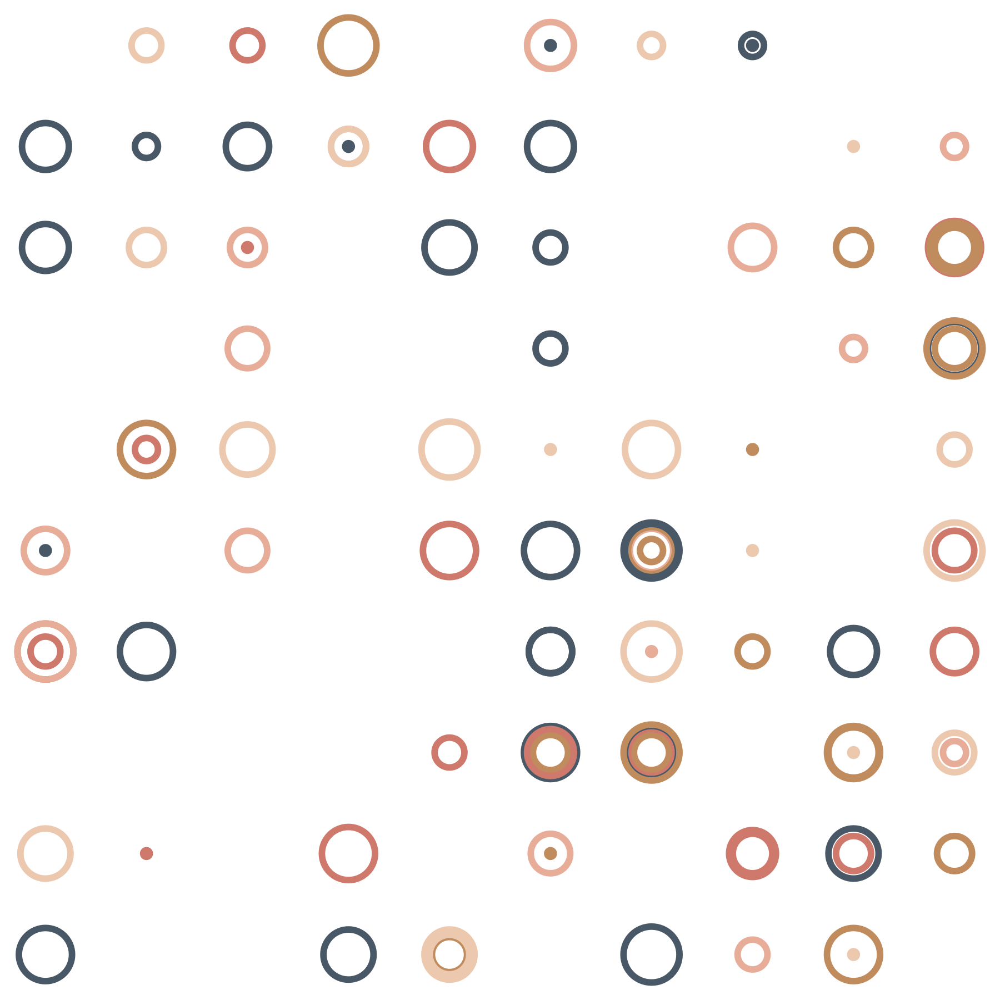

It is the first day of my summer vacation. The out-of-office autoreply is on. I have a full tank of gas, half a pack of cigarettes, the sun is shining, and I'm wearing a sequined dress. Blues Brothers it is most certainly not, but a certain attitude is in force. And so it is that I've decided to get the band back together. Where "the band" in this case happens to be "a tool chain that looks like a shit version of [blogdown](https://pkgs.rstudio.com/blogdown/)".

Is it a good use of my time? No. Will I do a good job of it? No. But will it it make a good blog post? Also no.

Okay. So here's the backstory. Literate programming in R has been around for a very long time. So much so that we've all become accustomed to thinking about tools like [R markdown](https://rmarkdown.rstudio.com/), [blogdown](https://pkgs.rstudio.com/blogdown/), and [quarto](https://quarto.org/), as baked-in aspects to the language. That's not actually a bad thing. They're good tools. I have no intention of abandoning any of them. But they aren't primitives. Each of them is an opinionated tool that takes a code execution engine like [knitr](https://yihui.org/knitr/) as a starting point, and builds from it in different ways. R markdown and quarto both use knitr to execute the R code within an appropriately annotated markdown document and then feed the results to [pandoc](https://pandoc.org/) to create outputs in different formats. Blogdown takes the same idea, but passes the output to the [hugo](https://gohugo.io/) static site generator to create full featured blogs and static websites. Et cetera. 

What would happen if those "upstream" tools were taken away? What if you needed to create an R blog from scratch and the only part of this tool chain you had available to you was knitr. What choices would you make? Could you cobble together something vaguely similar to a blogdown site or a quarto blog, using entirely different constituent parts? 

Why would you do this? You wouldn't.

Why did I do it? Because it's summer and **I'm bored**.

## The task

So here's what I decided to do. Create a static website blog where:

- You write posts using a slightly fancy version of [markdown](https://www.markdownguide.org/)
- The code chunks within a post are executed using [knitr](https://yihui.org/knitr/)
- The static site is build using [eleventy](https://www.11ty.dev/)
- The styling of the pages is handled with [skeleton](http://getskeleton.com/)

Most importantly, I committed myself to following the [Bob Katter principle](https://www.youtube.com/watch?v=1i739SyCu9I):

> *I ain't spending any time on it, because in the meantime, every three months a person's torn to pieces by a crocodile in North Queensland* 

Wise words Bob. Let's get this done in an afternoon, yeah?

## Code execution with knitr

Here's the idea. This post is written in what I'm calling "knitr-flavoured markdown", and the basic idea is so similar to R markdown that it'd be plagiarism for me to pretend I was doing anything novel. There's a [YAML](https://yaml.org/) header at the top of the document, and the code chunks that I want to execute have the annotations that knitr expects to see. Other than that, it's just markdown. Nothing special.

Like a normal markdown document, I use triple backticks to denote a code block. Moreover, since syntax highlighting is supported, I can write something like this in the source document...


````default
```r
add_one <- function(x) x + 1
add_one(10)
```
````

and the output will look like this:

```r
add_one <- function(x) x + 1
add_one(10)
```

Most importantly, the blog supports code execution. When I write this in my source document...


````default
```{r}
add_one <- function(x) x + 1
add_one(10)
```
````

The code is executed by knitr and the output appears beneath the code block:


```r
add_one <- function(x) x + 1
add_one(10)
```

```
## [1] 11
```

Better yet, it supports plot output:


```r
library(ggplot2)
set.seed(1)
df <- data.frame(
  x = sample(1:10, size = 100, replace = TRUE),
  y = sample(1:10, size = 100, replace = TRUE),
  size = sample(1:10, size = 100, replace = TRUE),
  shade = sample(colours(), size = 100, replace = TRUE)
)
ggplot(df, aes(x, y, size = size, colour = shade)) +
  geom_point(show.legend = FALSE, pch = 1 , stroke = 2) + 
  scale_size(range = c(0, 10)) + 
  theme_void()
```

<div class="figure" style="text-align: center">

<p class="caption">plot of chunk make-a-plot</p>
</div>

Neat. 

## From source code to the built HTML

So how does this work? From the perspective of knitr, everything takes place within the folder that contains the "knitr flavoured markdown" document. To distinguish this source document from the knitr output the knitr-flavoured markdown file has a `.kmd` file extension, whereas the plain markdown produces as output has a `.md` file extension. Here's everything that exists within the post folder:


```r
 fs::dir_tree()
```

```
## .
## ├── figure
## │   └── make-a-plot-1.png
## ├── index.kmd
## └── index.md
```

The **only** thing I edit myself is the `.kmd` file. From my perspective as the coder/blogger/whatever that's my source code. This is fundamentally no different to the way that R markdown treats the `.Rmd` file as the source, or how quarto treats the `.qmd` file as the source. This is hardly surprising. This supposed "kmd" file format isn't really anything new, and the only reason I bothered to give it a new file extension is that I wanted to keep it clear in my head that the YAML header in the `.kmd` file exists to support eleventy (not pandoc), and that my "kmd" format is much more bare-bones than either "Rmd" or "qmd".

Anyway, let's look at what happens when I use `knitr::knit()` to render this file. The primary output file is the `.md` file, which retains all the original markdown from the `.kmd` file, but executes the R code chunks within the file and creates additional markup within the `.md` file so that -- when later converted to HTML -- the resulting web page will display the output exactly as if the commands were typed at the R console. However, because this post also contains R code that generates a plot, knitr creates a `.png` file within the `figure` folder, and includes markup that links to that `.png` file. 

And with that, knitr has no further role to play. For any given post, knitr only acts within the corresponding post folder. It has created the `.md` file and the `.png` file, and it's done. The baton is passed over to eleventy, and as far as eleventy is concerned, the `.kmd` file is irrelevant. When creating the HTML output, eleventy looks only at the `.md` file and the `.png` file. 

So what happens when eleventy builds the static site? To get a "global" overview, let's take a look at the structure of the blog project, showing only the folders:


```r
 fs::dir_tree("../..", type = "directory")
```

```
## ../..
## ├── _includes
## ├── docs
## │   └── posts
## │       ├── changelog
## │       ├── hello-changelog
## │       ├── knitted-markdown
## │       ├── the-blogdown-of-theseus
## │       │   └── figure
## │       └── the-changelog
## └── posts
##     ├── hello-changelog
##     ├── knitted-markdown
##     └── the-blogdown-of-theseus
##         └── figure
```

The core structure is very simple:

- There's a `posts` folder that contains one subfolder for each post in the blog. That's where all the markdown files live, and it's also where knitr renders its output. From the perspective of the eleventy static site generator, that's our source folder
- There's a `docs` folder that also contains one subfolder for each post. This one is where all the HTML files, CSS files, etc go. That's the built site that gets deployed to GitHub Pages. 

To illustrate the difference between the two, let's compare the contents of the source folder for this post (which we saw in the last section) to the corresponding folder in the built site:


```r
 fs::dir_tree("../../docs/posts/the-blogdown-of-theseus")
```

```
## ../../docs/posts/the-blogdown-of-theseus
## ├── figure
## │   └── make-a-plot-1.png
## └── index.html
```

This is what eleventy does to each of the files in the post folder:

- The `.png` file gets copied to the output as-is
- The `.kmd` file is ignored completely
- The `.md` file is converted to the `.html` page

There's a tiny bit of fanciness required to configure eleventy in a way that plays this nicely with knitr, but only a tiny bit. I'll come back to it later but seriously it was way easier than I thought it was going to be.
